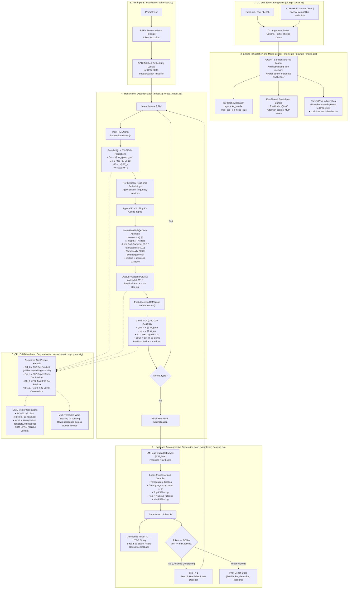

# An experinental zig based llm inference engine
curently cpu and cuda only also i only been able to test it on linux so it might behave diffrent on diffrent oses

#### Models tested
- smollm2-360m
- gemma 2 / gemma 4 and variants
- llama 3 / mistral / qwen

## System requirements 

#### for cpu inference:
in the current action pipeline i compile it for x86_64_v3 so if you have an older cpu it will probably throw an illegal instrustion error even if 
you try to offload stuff to the gpu so i would recommend you to compile it yourself if you have an older cpu.

#### for cuda inference:
currently the kernels are being compiled with cuda 13.3 and kernels for every compute capability from touring and up is provided  so it should work on rtx 20/1650 and up.

#### How to try it out
1. first you need to clone the repo and get the zig compile for your os of choice but this has been only tested on linux so idk if it will work on anything else
2. you need to build it via 
```sh 
zig build -Doptimize=ReleaseFast -Dcpu=native

```
or you can download the precompiled binary and cuda kernels from the releases tab but for the best cpu performance you need to compile it your self 

3. now you can try out models that you downloaded 
```sh 
./zig-out/bin/ziglm run -m <path_to_the_model_folder> -p "<prompt>" --greedy -n <number_of_tokens_to_generate>
```
or see the help command for all the options that are possible
```sh
./zig-out/bin/ziglm --help
```

# performance
## CPU
curently according to my tests closely matches  the $\text{TPS} = \frac{\text{System RAM Bandwidth (GB/s)}}{\text{Model Size (GB)}}$  so i dont think i can improve more.
<details>
<summary>see current cpu architechture</summary>



</details>

## CUDA
the current cuda backend is kinda experimental so i havent done a lot of benchmarking stuff yet so its probably unoptimized and i need to work on it

# Dependencies 
- a zig compiler (if you want to compile everything from source)
- nvcc / CUDA toolkit (for compiling CUDA GPU acceleration kernels)


more coming soontm