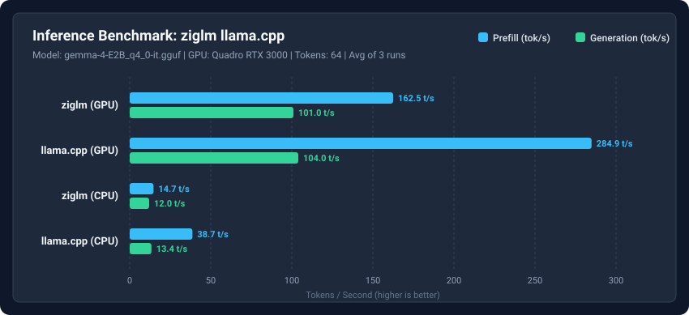

# Inference Benchmark: ziglm llama.cpp

- **Date**: 2026-09-20 19:15:45
- **Model**: `gemma-4-E2B_q4_0-it.gguf`
- **Prompt**: "Explain how quicksort works in three sentences."
- **Max Tokens**: 64
- **Runs**: 3 iterations
- **GPU**: `Quadro RTX 3000`

## Performance Results

| Engine | Prefill Rate | Generation Rate | Latency |
| :--- | :---: | :---: | :---: |
| **ziglm (GPU)** | 162.5 tok/s | 101.0 tok/s | 745.2 ms |
| **llama.cpp (GPU)** | 284.9 tok/s | 104.0 tok/s | 671.4 ms |
| **ziglm (CPU)** | 14.7 tok/s | 12.0 tok/s | 6577.1 ms |
| **llama.cpp (CPU)** | 38.7 tok/s | 13.4 tok/s | 5212.1 ms |

## Performance Chart

## Output Parity & Quality

### ziglm (GPU)

> Quicksort is a divide-and-conquer algorithm that works by selecting an element as a "pivot" and partitioning the array into two sub-arrays: one with elements less than the pivot and one with elements greater than the pivot. It then recursively applies the same logic to the sub-arrays, placing the 

### llama.cpp (GPU)

> Quicksort is a divide-and-conquer algorithm that works by selecting a 'pivot' element from the array and partitioning the other elements into two sub-arrays: those less than the pivot and those greater than the pivot. It then recursively applies the same logic to the sub-arrays, sorting them in place 

### ziglm (CPU)

> Quicksort is a divide-and-conquer algorithm that works by selecting an element as a "pivot" and partitioning the array into two sub-arrays: those with smaller and larger values than the pivot. It then recursively applies the same logic to the sub-arrays, placing the pivot in its correct sorted position 

### llama.cpp (CPU)

> Quicksort is a divide-and-conquer algorithm that works by selecting an element as a "pivot" and partitioning the array into two sub-arrays: elements less than the pivot and elements greater than the pivot. It then recursively applies the same logic to the sub-arrays, sorting them in place. This 

